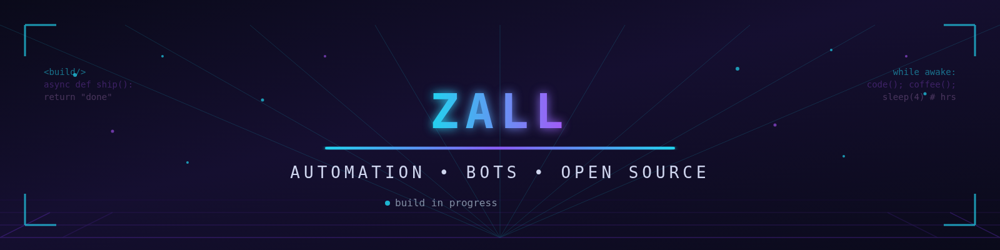

  

  

---

## 👋 about me

Self-taught automation & bot builder from **Indonesia** 🇮🇩. I like turning repetitive tasks into scripts that run themselves, and I'm usually deep in some rabbit hole — Playwright, Telegram bots, API stuff, or the occasional VPS adventure.

- 🔭 currently working on: **TokenHarbour Farm** — an all-in-one CLI for account farming & API key management
- 🌱 learning: cleaner async patterns, better OAuth flows, and how to not break prod at 2am
- 🎯 goal: ship tools that are genuinely useful, then keep making them better
- ⚡ fun fact: my `sleep(4)` comments are optimistic — it's always 4 hours too few

---

## 🧰 stack

---

## 📌 featured

### [🔗 TokenHarbour Farm](https://github.com/SyncJax/tokenharbour-farm)

> CLI all-in-one: farm akun, verifikasi email, cek API key, import ke 9router, enable free models.

---

## 📊 stats

  

  
  

  

---

## 📫 find me

  
  
  

  

